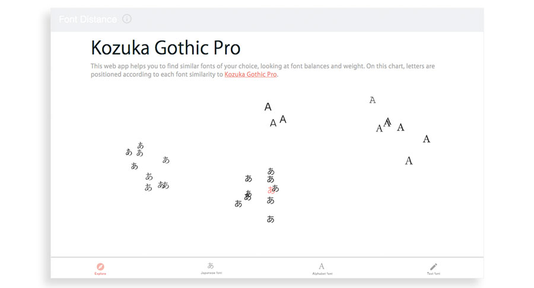
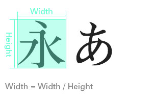
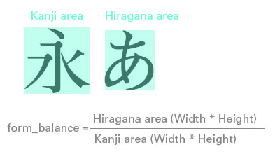
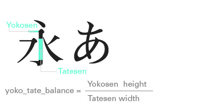
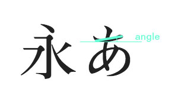
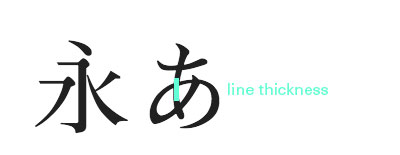
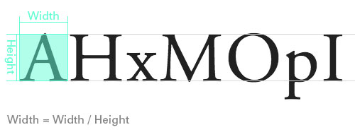
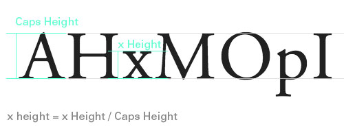
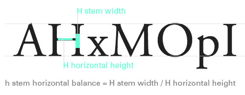
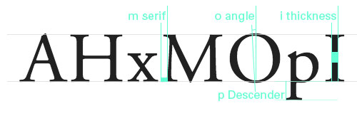

It's a web app to find font, using [Google App Engine with Python](https://cloud.google.com/python/) and a Python template engine [Jinja2](http://jinja.pocoo.org/). You can find this web app [here](https://font-distance.appspot.com/). 

[This](https://github.com/YukinoKoh/font-distance/blob/master/170919_uxtalktokyo.pdf) is a slide file for [UX Talk Tokyo](http://www.uxtalktokyo.com/announcing-ux-talk-tokyo-39/) about *UX around Machine Learning*.

This app includes..
- Visualized font relationship page
- Sorted list of fonts according to their similarity in English and in Japanese
- Test page with input text fields
- About page 

## File structure
- `src`: Resource folder
  - `app.yaml`: yaml file for Google App Engine
  - `main.py`: Python file to import modules
  - `settings.py`: Python file to manage site name and other key words
  - `handlers` (folder):
    - Jinja2 handlers written in Python
    - `distance.py`: It generates [main page](https://font-distance.appspot.com/)
    - `sort.py`: It generates sorted list pages in [Japanese](https://font-distance.appspot.com/sort/jp) and in [English](https://font-distance.appspot.com/sort/en)
    - `typeset.py`: It geneartes [font test page](https://font-distance.appspot.com/typeset)
    - `about.py`: It generates [about page](https://font-distance.appspot.com/about)
    - `list_i.py`: It generates [list of font page](https://font-distance.appspot.com/list/distance)
    - `jp_center.py``en_center.py`: Font data to store
    -  `util.py`: Fomula to calcurate each font similarities
    - `handler.py`: helper file to generate html with the above python files and Jinja2
    - `templates` (folder): Template html files.
  - `models` (folder): Files contain font data structure and related function 
  - `css` (folder): Of css file(s)
  - `sass` (folder): Of sass file(s)
  - `img` (folder): Of image files 
- `img` (folder): Of image files for this README.
- `Gruntfile.js`: It is to compile sass to css.
- `Gruntfile.yml`: Same as the above.
- `node_modules`: Same as the above.
- `package-lock.json`: Same as the above. 
- `package.json`: Same as the above.
- `README.md`
- `LICENCE.md`

## Set up
1. Install [Google Cloud SDK for Python](https://cloud.google.com/sdk/docs/quickstart-mac-os-x)
    * Make sure that you can use gcloud command
2. Run app locally with the following command in `src` folder.
```    
$ dev_appserver.py .
```
3. Check running at
- Module "default" running at: http://localhost:8080. 
- Admin server at: http://localhost:8000.

4. Install [Grunt](https://gruntjs.com/), if you want to use `Gruntfile.js` to run sass compiler.


## To modify formula to calcurate font similarity 
The fomula is written in `util.py` in `src/handlers`.

```python
def calc_distance(ref_font, font_list):
    log_font = []
    ref_num = ref_font.get_num()
```
`ref_font` is the selected font and `font_list` is all font data, which structure is stored in `src/models`. `log_font` will contain a list of font data with calcurated similarity number. `get_num()` function returns font data, which you can find in `src/models/jp_family.py` and `src/models/en_family.py`. 

Then the loop will proceed the following data calcuration through all font data
```python
# compare width
dis_width = (its_num[1] - ref_num[1])*10
# compare form balance
dis_form_b = (its_num[2] - ref_num[2])*10
# compare line balance 
dis_line_b = (its_num[3] - ref_num[3])*5
# compare angle 
dis_angle = (its_num[4] - ref_num[4])*0.1
# compare line thickness
dis_line = (its_num[5] - ref_num[5])*0.1
```

Finally it normalize the data and flips the distance according to whether the font is serif or san serif.
```python
if ref_font.category == 'serif' and font.category == 'mincho':
    font.distance_h = pow(10/(dis_line_b + dis_angle + dis_line),2)
elif ref_font.category == 'mincho' and font.category == 'serif':
    font.distance_h = pow(10/(dis_line_b + dis_angle + dis_line),2)
else:
    font.distance_h = (dis_line_b + dis_angle + dis_line)
```

## To add font data
#### 1. Add font data
To add Japanese font data, write additional code in `src/handlers/jp_center.py`, which data structure is described [here](#japanese-font-data).

To add English font data, write additional code in `src/handlers/en_center.py`, which data structure is described [here](#english-font-data).

#### 2. Show the additional data in the web app
- Add font source data in the header of `src/handlers/templates/base.html`
- Specify font family in `src/css/jp_font.css` or `src/css/en_font.css`.
```css
.noto_serif {
  font-family: "Noto Serif"; }
```
This style name should be defined based on the `name` written in the data `jp_center.py` or `en_center.py`. Any space in `name` will be replaced with `-` and all uppercase will be replaced with its lowercase. 
For example, *Noto Serif* will be *noto_serif*.
  

## Japanese font data
Japanese font data is defined in `src/handlers/jp_center.py` as the following:
- `width`: width / height
- `form_balabce`: hiragana 'a' / kanji 'ei' area
- `yoko_tate_balance`: yokosen height / tatesen width of kanji'ei'
- `angle`: yokosen of hiragana 'a'
- `line_thickness`: chrome 500% screen capture font-size: 20px











## English font data
English font data is defined in `src/handlers/en_center.py` as the following:
- `width`: x A width / A height
- `x height`: x height / cap height
- `m serif`: serif length of m 500% chrome screen - font-size 20px
- `h_stem_horizontal_balance`: H horizontal height / H stem width
- `o_stroke_axis`: angle 0 - vertical  
- `p_sdecender`: p descender / caps height 
- `i_line_thickness`: thickness of i 500% chrome screen - font-size 20px









## If you can ...
If you have some idea to show font similarity visualization ([this](https://font-distance.appspot.com/)) without overlapping individual fonts, please let me know!

## Deploy App Engine
1. Direct to `src` in terminal (if Mac).
2. Run the following command.
```
$gcloud app deploy
```
3. Follow the instruction to choose account, project to deploy.

## License
[MIT License](https://choosealicense.com/licenses/mit/) © [Yukino Kohmoto](http://yukinokoh.github.io/)

